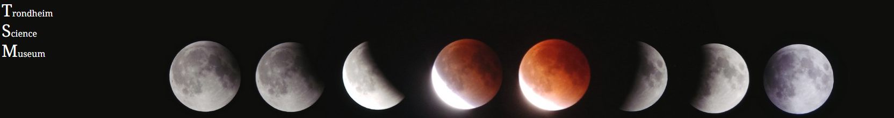

Cross-Course Project



## Description

This is my Semester project 1 submission. I was tasked with creating a webpage for a community science museum.

## Built With

This site is built with Html,Css.

## Getting Started

Visit the website [here](https://trondheim-science-museum.netlify.app/)

### Installing

1. Clone the repo:

https://github.com/robfil50219/Semester-Project-1---Trondheim-Science-Museum.git

2. Install the dependencies:

```
open repo with vs code.
```

### Running

Select the index.html file and click run.

## Contributing

This repo is not open for contrubusion.

## Contact

https://www.facebook.com/robert.filep?locale=nb_NO
https://www.instagram.com/robert_filep/
